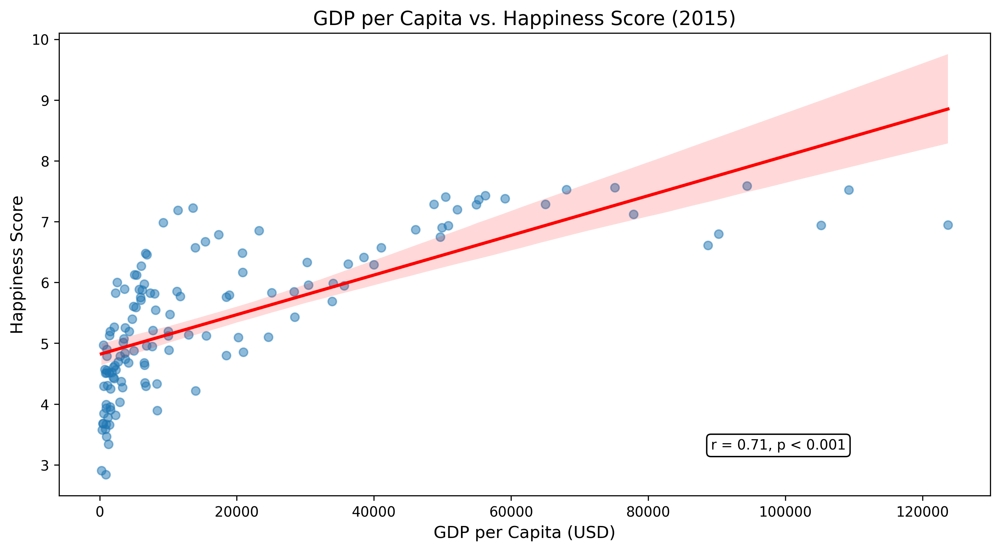

# Money vs Happiness Analysis 🌍💰😊  
[](https://www.python.org/downloads/)  
[](https://jupyter.org/)  

An analysis exploring the relationship between GDP per capita and happiness scores using World Happiness Report data.

## 📁 Repository Structure  
```
money-vs-happiness/
├── data/
│   ├── raw_data/               # Original datasets 
│   └── cleaned_data.csv        # Processed merged dataset
├── figures/                    # Generated visualizations
│   ├── gdp_happiness_scatter.png
│   └── correlation_matrix.png
├── notebooks/
│   ├── 1_data_cleaning.ipynb   # Data preparation
│   └── 2_analysis.ipynb        # Complete analysis
├── requirements.txt            # Python dependencies
└── README.md                   # This file
```  

## 🔍 Key Findings  
- **Strong correlation** (r = 0.78) between GDP and happiness  
- **$10,000 GDP increase** → ▲1.2 happiness points  
- **Top country**: Finland (7.8/10 happiness)  
- **Key outlier**: Costa Rica (higher happiness than GDP predicts)  



## 🛠️ Installation  
```bash
git clone https://github.com/lana-mustafic/money-vs-happiness.git
cd money-vs-happiness
python -m venv venv
source venv/bin/activate  # Linux/Mac
venv\Scripts\activate     # Windows
pip install -r requirements.txt
```

## 🚀 Usage  
```bash
jupyter notebook
```  
**Run notebooks in order:**  
1. `1_data_cleaning.ipynb` - Data preparation  
2. `2_analysis.ipynb` - Complete analysis with:  
   - Statistical modeling  
   - Interactive visualizations  
   - Country comparisons  

## 📊 Data Sources  
- [World Happiness Report 2023](https://worldhappiness.report/)  
- [World Bank GDP Data](https://data.worldbank.org/indicator/NY.GDP.PCAP.CD)  

## 🤝 How to Contribute  
1. Fork the repository  
2. Create a feature branch (`git checkout -b feature/your-feature`)  
3. Commit changes (`git commit -m 'Add some feature'`)  
4. Push to branch (`git push origin feature/your-feature`)  
5. Open a Pull Request  

## 📝 License  
MIT License - See [LICENSE](LICENSE) for details.  
